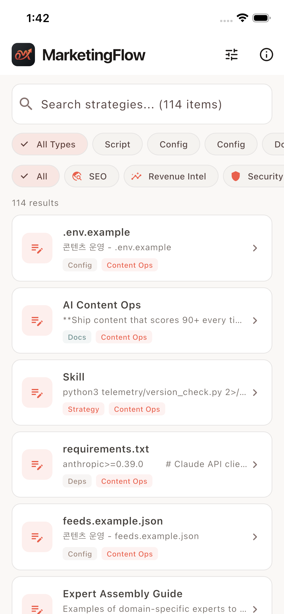
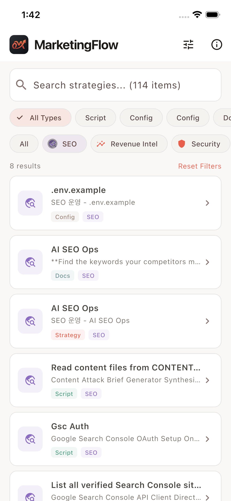
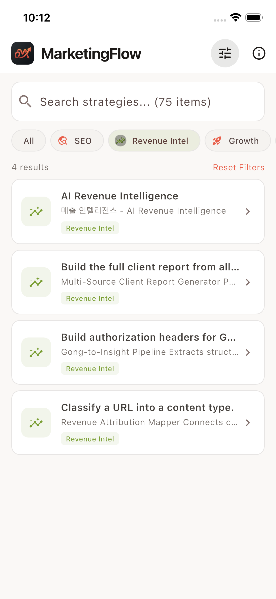
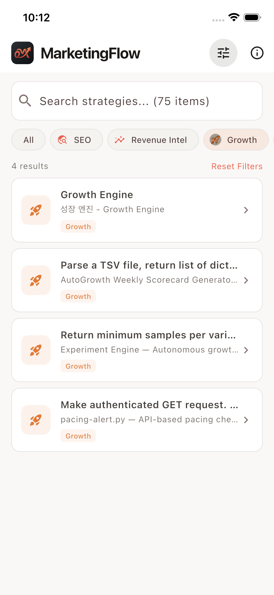
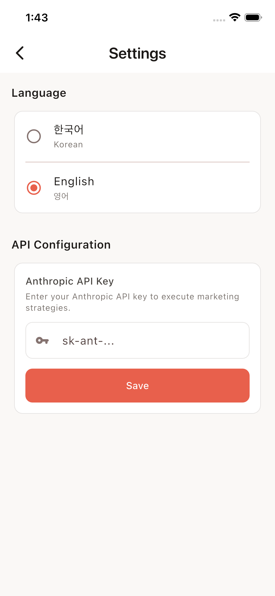
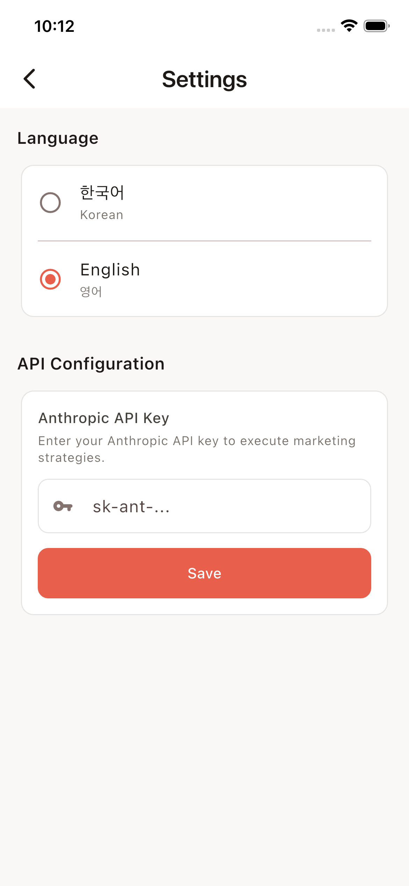
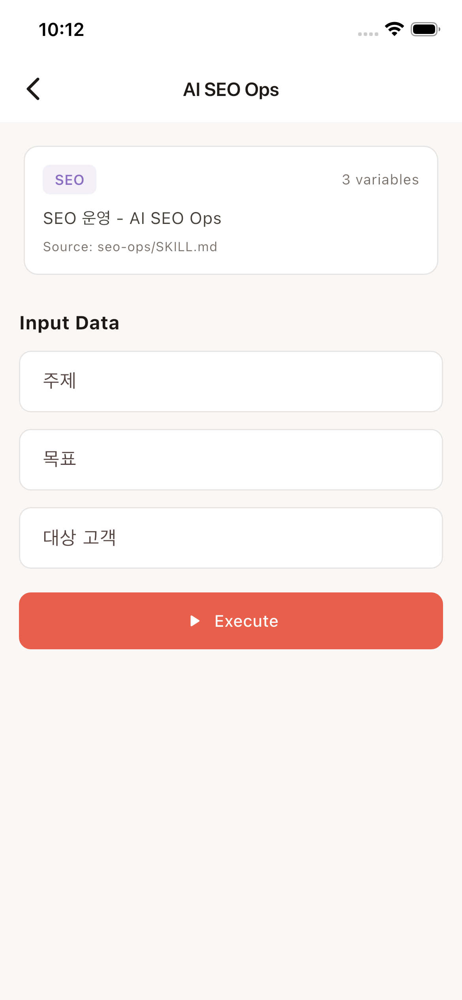
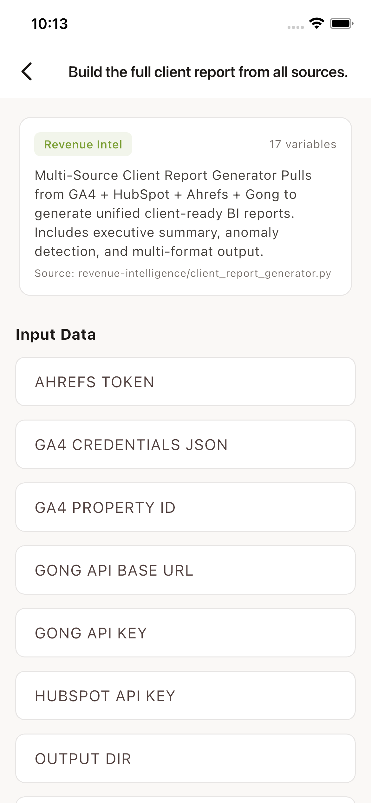

<p align="center">
  
</p>

<h1 align="center">MarketingFlow</h1>

<p align="center">
  <strong>Marketing Strategy Execution Platform</strong><br>
  Transform expert marketing knowledge into actionable strategies
</p>

<p align="center">
  
  
  
  
  
  
</p>

<p align="center">
  <a href="README.md">English</a> ·
  <a href="README_KO.md">한국어</a>
</p>

---

## Overview

MarketingFlow is a cross-platform Flutter application that runs on **iOS, Android, macOS, Windows, Linux, and Web**. It extracts the complete knowledge base from the [ai-marketing-skills](https://github.com/ericosiu/ai-marketing-skills) open-source project and transforms it into an interactive strategy execution tool.

**75 marketing strategies** across **11 categories** — from content operations to sales playbooks — are packaged into a single codebase that works on every platform where users can browse, search, and execute strategies powered by LLM.

## Screenshots

<p align="center">
  &nbsp;
  &nbsp;
  &nbsp;
  
</p>
<p align="center">
  &nbsp;
  &nbsp;
  &nbsp;
  
</p>

## Features

### Complete Knowledge Extraction
All marketing assets from the source repository are extracted and categorized:

| Type | Count | Description |
|------|-------|-------------|
| Strategy Definitions | 11 | Core SKILL.md workflow definitions |
| Expert Personas | 9 | Specialized evaluator profiles (LinkedIn, SEO, Newsletter...) |
| Automation Scripts | 42 | Python scripts for marketing automation |
| References | 13 | Templates, patterns, and guidelines |
| Scoring Rubrics | 5 | Content quality evaluation frameworks |
| Documentation | 13 | Category README files |
| Configurations | 10 | Environment templates and configs |
| Dependencies | 11 | Requirements files |
| **Total** | **114** | |

### 13 Marketing Categories

| Category | Assets | Key Tools |
|----------|--------|-----------|
| **Content Ops** | 26 | Expert panel evaluation, platform-specific content (LinkedIn, Instagram, X, YouTube Shorts, Newsletter), humanizer, SEO strategy |
| **Finance Ops** | 13 | CFO analyzer, scenario modeler, ROI calculator, QuickBooks integration |
| **Outbound Engine** | 13 | Cold outbound sequences, competitive monitoring, lead pipeline, Instantly audit |
| **Sales Pipeline** | 11 | Deal resurrector, ICP learning, RB2B webhook/routing, trigger prospecting |
| **SEO Ops** | 8 | Content attack briefs, Google Search Console integration, trend scouting |
| **Growth Engine** | 7 | Experiment engine (ICE scoring), weekly scorecard, pacing alerts |
| **Sales Playbook** | 7 | Call analyzer, value pricing briefing/packager, pricing patterns |
| **Revenue Intelligence** | 6 | Client reports, Gong insights, multi-touch attribution |
| **Conversion Ops** | 5 | CRO audit framework, survey lead magnets |
| **Team Ops** | 5 | Meeting action extraction, "Elon Algorithm" performance audits |
| **Podcast Ops** | 5 | Full pipeline from ideation to distribution |
| **Telemetry** | 5 | Logging, reporting, version tracking |
| **Security** | 3 | Pre-commit hooks, sanitizer |

### App Features

- **Dynamic Form Builder** — Automatically generates input forms based on each strategy's required variables
- **Strategy Execution** — Combines system prompts with user inputs and sends to Anthropic Claude API
- **Markdown Viewer** — Rich rendering of generated strategies with copy-to-clipboard
- **Bilingual UI** — Full Korean and English interface, switchable in settings
- **Warm Design System** — Professional coral/amber palette designed for marketing teams, not a tech-heavy look
- **License Compliance** — Full MIT license and attribution displayed in-app
- **Auto-Update Script** — Python extractor to sync with upstream repository changes

## Architecture

```
lib/
├── main.dart                      # App entry with state management
├── app_state.dart                 # Global state (locale, API key)
├── theme.dart                     # Warm coral design system
├── l10n/
│   └── app_locale.dart            # EN/KR translations
├── models/
│   └── marketing_skill.dart       # Data models + JSON loader
├── screens/
│   ├── home_screen.dart           # Search, filter, browse
│   ├── skill_detail_screen.dart   # Strategy execution
│   ├── settings_screen.dart       # Language + API config
│   └── about_screen.dart          # License & attribution
├── services/
│   └── ai_response_service.dart   # Anthropic Claude API
└── widgets/
    ├── dynamic_form_builder.dart  # Auto-generated input forms
    └── markdown_viewer.dart       # Rich markdown display

assets/
└── marketing_knowledge_base.json  # 114 extracted marketing assets (1.15 MB)

scripts/
└── extract_knowledge.py           # Python extractor for upstream sync
```

## Getting Started

### Prerequisites
- Flutter SDK 3.11+
- Anthropic API key (for strategy execution)
- Python 3.8+ (for knowledge base updates)

### Installation

```bash
git clone https://github.com/kimdzhekhon/MarketingFlow.git
cd MarketingFlow
flutter pub get
flutter run
```

### One-Command Setup (from scratch)

```bash
bash setup_full_extraction.sh
```

This script clones the source repository, extracts all 114 assets, generates the app logo, and sets up the complete Flutter project.

### Update Knowledge Base

When the upstream repository adds new content:

```bash
git clone https://github.com/ericosiu/ai-marketing-skills.git /tmp/source
python3 scripts/extract_knowledge.py /tmp/source assets/marketing_knowledge_base.json
```

## Data Pipeline

```
ericosiu/ai-marketing-skills (GitHub)
        │
        ▼
scripts/extract_knowledge.py  ──  Recursive scan of .md, .py, .json, .env, .txt
        │
        ▼
assets/marketing_knowledge_base.json  ──  114 items, 9 types, 13 categories
        │
        ▼
Flutter App  ──  Browse → Select → Input → Execute → View Results
```

## License

This project is licensed under the **MIT License**.

### Attribution

The marketing knowledge base is derived from **[ai-marketing-skills](https://github.com/ericosiu/ai-marketing-skills)** by **Eric Siu / Single Grain**.

```
MIT License — Copyright (c) 2026 Single Grain
```

Full license text is displayed in the app's About screen.

---

<p align="center">
  Built with Flutter + Claude API
</p>
