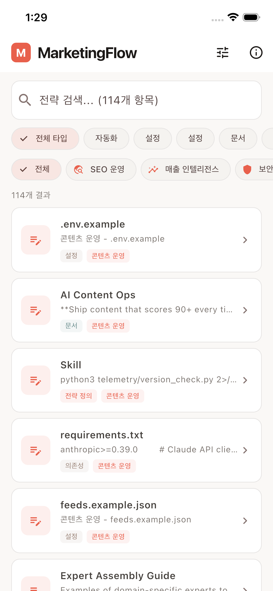

<p align="center">
  
</p>

<h1 align="center">MarketingFlow</h1>

<p align="center">
  <strong>마케팅 전략 실행 플랫폼</strong><br>
  전문가의 마케팅 지식을 실행 가능한 전략으로 변환합니다
</p>

<p align="center">
  <a href="README.md">English</a> ·
  <a href="README_KO.md">한국어</a>
</p>

---

## 개요

MarketingFlow는 [ai-marketing-skills](https://github.com/ericosiu/ai-marketing-skills) 오픈소스 프로젝트의 전체 지식 베이스를 추출하여 인터랙티브 전략 실행 도구로 변환하는 Flutter 앱입니다.

콘텐츠 운영부터 세일즈 플레이북까지 **13개 카테고리**의 **114개 마케팅 자산**이 모바일 퍼스트 인터페이스에 패키지되어 있으며, 사용자는 전략을 탐색, 검색, 실행할 수 있습니다.

## 스크린샷

<p align="center">
  
</p>

| 홈 화면 | 카테고리 필터 | 정보 및 라이선스 | 매출 인텔리전스 |
|---------|-------------|----------------|---------------|
| 114개 전략 탐색 | 색상 코드 카테고리 필터 | MIT 라이선스 및 저작자 고지 | 카테고리별 필터링 |

## 주요 기능

### 완전한 지식 베이스 추출
소스 리포지토리의 모든 마케팅 자산을 추출하고 분류합니다:

| 타입 | 수량 | 설명 |
|------|------|------|
| 전략 정의 | 11 | 핵심 SKILL.md 워크플로우 정의 |
| 전문가 페르소나 | 9 | 특화된 평가자 프로필 (LinkedIn, SEO, 뉴스레터 등) |
| 자동화 스크립트 | 42 | 마케팅 자동화 Python 스크립트 |
| 참고자료 | 13 | 템플릿, 패턴, 가이드라인 |
| 평가 루브릭 | 5 | 콘텐츠 품질 평가 프레임워크 |
| 문서 | 13 | 카테고리별 README 파일 |
| 설정 | 10 | 환경 템플릿 및 설정 파일 |
| 의존성 | 11 | Requirements 파일 |
| **합계** | **114** | |

### 13개 마케팅 카테고리

| 카테고리 | 자산 수 | 주요 도구 |
|----------|---------|----------|
| **콘텐츠 운영** | 26 | 전문가 패널 평가, 플랫폼별 콘텐츠 (LinkedIn, Instagram, X, YouTube Shorts, 뉴스레터), 휴머나이저, SEO 전략 |
| **재무 운영** | 13 | CFO 분석기, 시나리오 모델러, ROI 계산기, QuickBooks 연동 |
| **아웃바운드 엔진** | 13 | 콜드 아웃바운드 시퀀스, 경쟁 모니터링, 리드 파이프라인, Instantly 감사 |
| **세일즈 파이프라인** | 11 | 딜 부활, ICP 학습, RB2B 웹훅/라우팅, 트리거 프로스펙팅 |
| **SEO 운영** | 8 | 콘텐츠 공격 브리프, Google Search Console 연동, 트렌드 스카우팅 |
| **성장 엔진** | 7 | 실험 엔진 (ICE 스코어링), 주간 스코어카드, 페이싱 알림 |
| **세일즈 플레이북** | 7 | 콜 분석기, 밸류 프라이싱 브리핑/패키저, 가격 패턴 라이브러리 |
| **매출 인텔리전스** | 6 | 고객 리포트, Gong 인사이트, 멀티터치 어트리뷰션 |
| **전환 최적화** | 5 | CRO 감사 프레임워크, 설문 리드 마그넷 |
| **팀 운영** | 5 | 미팅 액션 추출, "엘론 알고리즘" 성과 감사 |
| **팟캐스트 운영** | 5 | 기획부터 배포까지 전체 파이프라인 |
| **텔레메트리** | 5 | 로깅, 리포팅, 버전 추적 |
| **보안** | 3 | Pre-commit 훅, 새니타이저 |

### 앱 기능

- **동적 폼 빌더** — 각 전략의 필수 변수를 기반으로 입력 폼을 자동 생성합니다
- **전략 실행** — 시스템 프롬프트와 사용자 입력을 결합하여 Anthropic Claude API로 전송합니다
- **마크다운 뷰어** — 생성된 전략을 가독성 높게 렌더링하며 클립보드 복사를 지원합니다
- **이중 언어 UI** — 한국어와 영어 인터페이스를 설정에서 전환할 수 있습니다
- **따뜻한 디자인 시스템** — 마케팅 팀을 위한 코럴/앰버 팔레트 (테크 느낌 배제)
- **라이선스 준수** — MIT 라이선스 전문과 원저작자 고지를 앱 내에 표시합니다
- **자동 업데이트 스크립트** — 상위 리포지토리 변경사항을 동기화하는 Python 추출기

## 아키텍처

```
lib/
├── main.dart                      # 앱 엔트리 + 상태 관리
├── app_state.dart                 # 전역 상태 (언어, API 키)
├── theme.dart                     # 따뜻한 코럴 디자인 시스템
├── l10n/
│   └── app_locale.dart            # 한/영 번역
├── models/
│   └── marketing_skill.dart       # 데이터 모델 + JSON 로더
├── screens/
│   ├── home_screen.dart           # 검색, 필터, 탐색
│   ├── skill_detail_screen.dart   # 전략 실행 화면
│   ├── settings_screen.dart       # 언어 + API 설정
│   └── about_screen.dart          # 라이선스 및 저작자 정보
├── services/
│   └── ai_response_service.dart   # Anthropic Claude API 연동
└── widgets/
    ├── dynamic_form_builder.dart  # 자동 생성 입력 폼
    └── markdown_viewer.dart       # 마크다운 렌더링

assets/
└── marketing_knowledge_base.json  # 114개 추출된 마케팅 자산 (1.15 MB)

scripts/
└── extract_knowledge.py           # 상위 리포 동기화용 Python 추출기
```

## 시작하기

### 사전 요구사항
- Flutter SDK 3.11+
- Anthropic API 키 (전략 실행 시 필요)
- Python 3.8+ (지식 베이스 업데이트 시)

### 설치

```bash
git clone https://github.com/kimdzhekhon/MarketingFlow.git
cd MarketingFlow
flutter pub get
flutter run
```

### 원커맨드 설정 (처음부터)

```bash
bash setup_full_extraction.sh
```

이 스크립트는 소스 리포지토리를 클론하고, 114개 자산을 모두 추출하고, 앱 로고를 생성하고, 전체 Flutter 프로젝트를 설정합니다.

### 지식 베이스 업데이트

상위 리포지토리에 새 콘텐츠가 추가되었을 때:

```bash
git clone https://github.com/ericosiu/ai-marketing-skills.git /tmp/source
python3 scripts/extract_knowledge.py /tmp/source assets/marketing_knowledge_base.json
```

## 데이터 파이프라인

```
ericosiu/ai-marketing-skills (GitHub)
        │
        ▼
scripts/extract_knowledge.py  ──  .md, .py, .json, .env, .txt 재귀 스캔
        │
        ▼
assets/marketing_knowledge_base.json  ──  114개 항목, 9개 타입, 13개 카테고리
        │
        ▼
Flutter 앱  ──  탐색 → 선택 → 입력 → 실행 → 결과 확인
```

## 라이선스

이 프로젝트는 **MIT License** 하에 배포됩니다.

### 저작자 고지

마케팅 지식 베이스의 원본은 **Eric Siu / Single Grain**의 **[ai-marketing-skills](https://github.com/ericosiu/ai-marketing-skills)**입니다.

```
MIT License — Copyright (c) 2026 Single Grain
```

전체 라이선스 텍스트는 앱의 정보 화면에서 확인할 수 있습니다.

---

<p align="center">
  Flutter + Claude API로 제작
</p>
